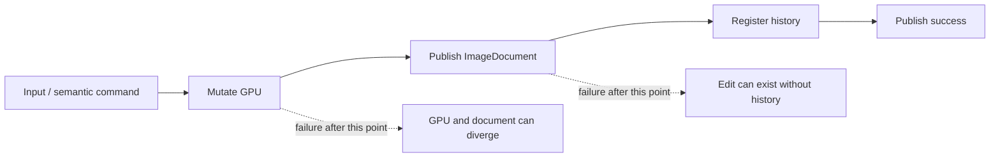
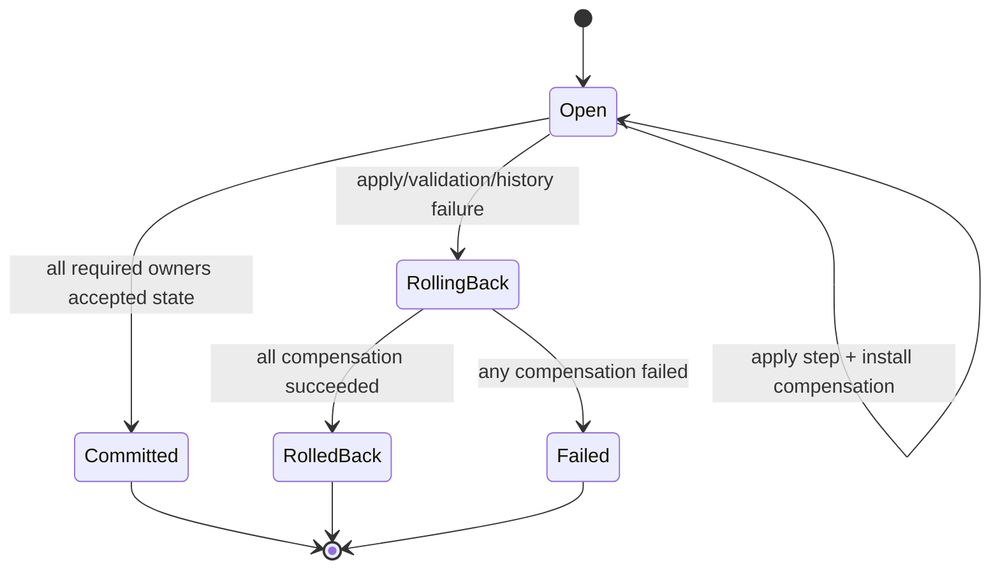
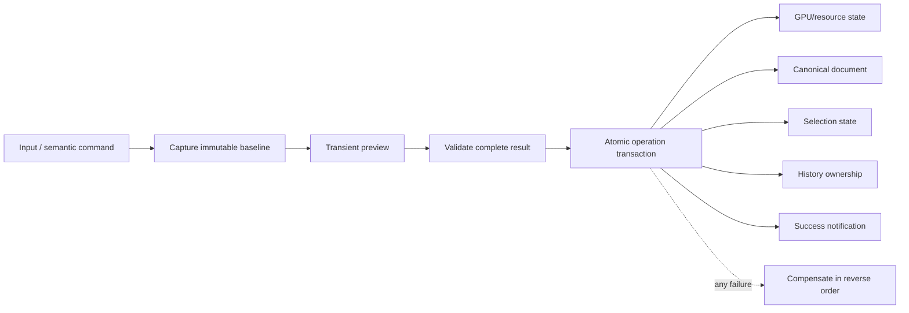

# Editor operation transaction model

Status: active stabilization contract  
Last audited: 2026-09-05  
Companion plan: [EDITOR_TRANSACTION_AND_RENDERING_STABILIZATION_PLAN.md](./EDITOR_TRANSACTION_AND_RENDERING_STABILIZATION_PLAN.md)

## Purpose

LightTable must never expose a command as successful while its canonical document,
GPU resources, selection, history, and visible projection describe different states.
This document records the verified ownership model, the current failure modes, and
the migration contract used to repair operations without redesigning their UX.

This is not a list of optimistic implementation intentions. A row can be marked
verified only when its production path and its failure/rollback path have both been
read and exercised.

## Canonical owners

| State | Canonical owner | Projection / cache | Lifetime |
| --- | --- | --- | --- |
| Layer tree and layer metadata | `ImageDocument` in `DocumentSession` | React panels and `LayerDocumentRenderer` | Document |
| Per-document selection recipe | `DocumentSession.editor.selection` | `SelectionTextureStore` r16float textures | Document recipe; renderer GPU projection |
| Pixel and mask content | Renderer-owned layer runtimes | Composite/render targets | Renderer, retained explicitly by history |
| Undo/redo topology | `DocumentCommandHistory` | History panel snapshot | Document |
| Tool choice and tool options | Application editor session | Toolbars and overlays | Application |
| Gesture preview | Owning tool/operation controller | Renderer preview | One interaction |
| Renderer readiness | Renderer lifecycle | Loading/error UI | Active presentation generation |

The important asymmetry is that layer metadata is canonical JavaScript state while
pixel content is currently canonical in renderer-owned GPU resources. Any pixel
operation therefore crosses at least two owners and must be transactional.

## Existing flow and the defect

Several controllers historically followed this sequence and assumed later calls
could not fail. That assumption is false during document replacement, renderer
loss, stale async completion, external-store publication, resource pruning, or a
history callback failure.

`DocumentCommandHistory` also restored its stack node when `undo()` or `redo()`
threw, but it could not restore resources already changed by that callback. The
stack could therefore say "undo available" while the GPU was already partly undone.

## Required flow

An operation is complete only after all required owners have accepted it. Status,
Actions recording, MCP completion, autosave scheduling, and success telemetry are
post-commit observers; none may cause or precede the commit.

## Transaction rules

1. Capture a baseline before the first mutable action.
2. Install compensation before invoking a dependency that may partially mutate.
3. Apply owner changes in an explicitly documented order.
4. Register history last, after runtime and canonical state agree.
5. Once history owns retained resources, cleanup and projection observers may
   report errors but may not throw the command back into an unowned state.
6. On failure, compensate completed steps in reverse order.
7. If compensation itself fails, surface a distinct rollback failure and keep all
   original causes. Never report generic success or silently continue.
8. Undo and redo are transactions too. If their second owner fails, compensate the
   first owner before returning failure.
9. Preview changes never create history. One completed gesture creates at most one
   entry; cancel restores the exact baseline.
10. Async completion must prove document identity, session identity, renderer
    generation, and relevant source revision before publishing.

## Verified operation audit

| Operation | Current owners and mechanism | Verified risk | Migration state |
| --- | --- | --- | --- |
| Fill / Clear selected pixels | GPU tile edit, `ImageDocument` revision, document history | GPU was committed before document/history with no rollback; undo changed GPU before document publication | First atomic slice implemented; commit, undo, and redo compensate failures |
| Generic document mutation | `useDocumentMutationController` publishes immutable trees; history stores before/after | Live preview is canonical; `reset()` forgets the transaction without restoring baseline | Audited, migration pending |
| Adjustment preview | staged `previewDocument` plus renderer publication | discard clears a ref but does not explicitly republish canonical state | Audited, migration pending |
| Selection replace / deselect | canonical operation recipe replayed into r16float GPU mask | layer-mask/transparency recipes require old revisions; undo can fail after unrelated document edits | Critical; immutable selection snapshot design pending |
| Selection translation | queued GPU transform followed by recipe publication | async completion and replay fallback can expose visual/canonical skew | Critical; pending after snapshot owner is resolved |
| Selection paint | live GPU mutation plus dab recipe/history | cancel restore is asynchronous; history stores replay intent rather than immutable result | Critical; pending |
| Pixel edit history tiles | renderer-owned before/after GPU tiles swapped by `ReversiblePixelEdit` | Resource is renderer-bound; caller must compensate document publication | Primitive is sound; callers must migrate |
| Image resize / document geometry | pre-encoded GPU resources exchanged as one reversible resource | Good reference pattern; still verify device-loss and publication failure at callers | Reference implementation, caller audit pending |
| Transform | renderer transform session plus canonical transform/pixel result | Repeated pointer-up and operation lifetime have historically caused progressive resampling and snap-state conflicts | Full audit pending; do not patch piecemeal |
| Merge / flatten / collapse | layer-tree mutation plus renderer resources and history retention | Reported undo and layer-kind failures show ownership is not consistently atomic | Full audit pending |
| Raster gradient / paint / warp | GPU edit plus document revision/history | Same multi-owner pattern as Fill; exact controller behavior differs | Audit and migration pending |
| Layer adjustments / effects / filters | metadata, derived pipelines/caches, renderer projection | Need distinction between reversible metadata and retained destructive output | Audit pending |

## Selection snapshot decision still required

The current canonical selection history is normally an array of operations, not an
immutable mask result. Replaying that array later is not equivalent to restoring a
snapshot:

- layer-mask selection checks the mask's original pixel revision;
- transparency selection checks the source content revision;
- composite-based selection checks a document revision;
- magic/similar selection can read different current pixels;
- paint selection reconstructs from dabs rather than restoring the accepted mask.

The GPU selection textures use `r16float`. Existing `readR8Texture` helpers assume
one byte per pixel and must not be used to snapshot these textures. A correct design
must choose and budget one of these owners explicitly:

1. document-lifetime 16-bit CPU mask snapshots with aligned GPU upload on restore;
2. retained GPU snapshots plus a documented renderer-recreation fallback;
3. a lossless compressed document-lifetime representation with measured costs.

Until that choice is implemented and tested across renderer recreation, selection
undo/redo must not be described as an immutable restore.

## History hardening completed in the first slice

- Listener exceptions no longer escape after the history state has changed.
- Resource-disposal exceptions are contained and reported after ownership changes.
- Resource pruning is an observer/cleanup action and no longer invalidates an
  already-recorded command by throwing through `record()`.
- Fill/Clear commit restores canonical state and GPU tiles if document publication
  or history registration fails.
- Fill/Clear undo and redo compensate the GPU when document publication fails.
- Success status and semantic command recording occur only after commit.

## Evidence baseline

At checkpoint `c4b2b276`:

- `@lighttable/app` typecheck passed.
- Full package test run: 3340 passed, one failed.
- The one failure was a stale WebGPU selection-transform harness missing the
  renderer dirty-invalidation dependency used by production. The harness is fixed
  in the first transaction slice.
- A non-failing React warning remains in `SearchField.test.tsx` for a controlled
  input without `onChange`; it belongs in the UI cleanup queue, not this transaction
  slice.

First transaction slice verification:

- 26 focused transaction, fill, history, and WebGPU selection tests pass.
- Full `@lighttable/app` suite passes: 536 files and 3351 tests.
- `@lighttable/app` typecheck passes.
- Injected failures cover document publication, history registration, undo
  publication, redo publication, rollback failure, listener failure, and cleanup
  failure.

## Review checklist for every migrated operation

Before code changes, write down:

1. canonical state owners;
2. immutable baseline and its lifetime;
3. preview-only state;
4. validation gates and stale-result tokens;
5. commit order;
6. reverse-order compensation for every step;
7. undo/redo ownership and resource disposal;
8. exact user-visible success, failure, and cancel behavior;
9. desktop/web and renderer-recreation implications;
10. focused failure injection proving the invariant.

If any row is unknown, the operation is not ready for implementation.

## Migration order

1. Shared synchronous transaction primitive and Fill/Clear proof.
2. Immutable selection snapshot/restore and deselect undo.
3. Selection translation and selection-paint gesture lifetime.
4. Raster gradient, paint, and warp on the same transaction boundary.
5. Transform as one immutable-source operation session with retained snap target.
6. Merge/flatten/collapse with layer-kind and resource ownership checks.
7. Adjustments, effects, filters, and derived-cache lifecycle.
8. Command parity across UI, Actions, and MCP.
9. Renderer readiness, first-frame continuity, device loss, and document switching.
10. Full workflow, memory, format, open/close, desktop, and static-web verification.
