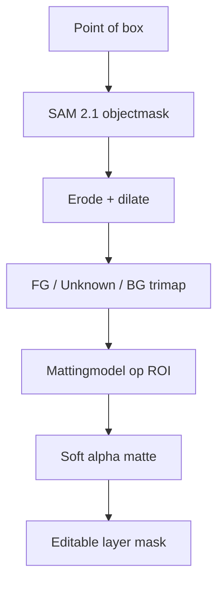

# SAM 2.1 + Matte Refinement voor LightTable

## Doel

Voeg een interactieve **Remove Background / Select Object**-workflow toe waarin SAM 2.1 bepaalt *welk object* de gebruiker bedoelt en een aparte refinement-pass de grove segmentatiemask omzet in een bruikbare, zachte alpha matte.

SAM 2.1 en image matting lossen verschillende problemen op:

- **SAM 2.1:** semantische objectselectie met punten, box of mask prompt.
- **Matte refinement:** nauwkeurige dekking langs haar, vacht, veren, motion blur, zachte randen en gedeeltelijke transparantie.

Een SAM-mask is hoofdzakelijk binair. Een alpha matte bevat per pixel een waarde tussen `0` en `1` en beschrijft hoeveel foreground werkelijk zichtbaar is.

```text
I = alpha * F + (1 - alpha) * B
```

Waarbij `I` de originele pixel is, `F` de foreground, `B` de background en `alpha` de geschatte dekking.

## Aanbevolen pipeline

1. De gebruiker klikt op een object of tekent een box.
2. SAM 2.1 genereert het geselecteerde objectmask.
3. LightTable maakt automatisch een trimap:
   - geërodeerde mask-interior: **zeker foreground** (`1`);
   - buiten de gedilateerde mask: **zeker background** (`0`);
   - band tussen beide: **unknown**.
4. Een mattingmodel ontvangt:
   - de originele RGB-afbeelding;
   - de trimap;
   - eventueel het oorspronkelijke SAM probability/logit mask.
5. Het model voorspelt alleen waar nodig een soft alpha matte.
6. De output wordt op documentresolutie edge-aware opgeschaald en als niet-destructief layer mask opgeslagen.



## Wat betekent de refinement-pass?

### 1. Echte neural alpha matting — aanbevolen

Een gespecialiseerd mattingmodel analyseert de RGB-pixels in en rond de onzekere randzone. Het kan nieuwe tussenwaarden voorspellen en daardoor fijne haren, zachte randen en gedeeltelijke dekking behouden.

Goede standaardoplossingen om te onderzoeken:

- **ViTMatte:** ontvangt RGB + trimap en is een logische architectuur voor de SAM-naar-trimap-workflow.
- **BiRefNet matting / HR-matting:** automatische of trimap-vrije matting; interessant als algemene kwaliteitsmodus.
- **BEN2:** gebruikt confidence-guided refinement en is interessant voor haar en complexe randen.
- **FBA Matting:** klassieke sterke RGB + trimap-oplossing die foreground, background en alpha kan schatten.
- **ZIM / Matting Anything:** inhoudelijk zeer relevant als prompt-to-matte-oplossing, maar runtime, ONNX-export en licentie moeten afzonderlijk worden gevalideerd.

De uiteindelijke productiekeuze moet worden gebaseerd op een eigen testset en op bewezen ONNX Runtime Web/WebGPU-compatibiliteit. Een PyTorch-model of bestaande ONNX-export is niet automatisch geschikt voor ONNX Runtime Web: operator support, dynamische shapes, geheugengebruik en numerieke verschillen moeten worden getest.

### 2. Edge-aware filter refinement — snelle fallback

Een guided filter, joint bilateral upsampling of vergelijkbare GPU-filter kan het lage-resolutiemask beter langs bestaande kleur- en luminantieranden leggen.

Dit is nuttig voor:

- mask upsampling;
- verminderen van kartelranden;
- corrigeren van kleine misalignment;
- snelle preview voordat neural refinement klaar is.

Dit is **geen echte matting**. Een filter kan geen haren herstellen die SAM al heeft gemist en begrijpt geen glas, rook of halftransparante stof. Noem deze interne stap daarom bijvoorbeeld `Edge-aware mask refinement`, niet `AI matting`.

### 3. Handmatige refine controls

Voor professioneel bruikbare resultaten blijft een kleine refine-workspace nodig:

- **Foreground brush:** dit hoort zeker bij het object.
- **Background brush:** dit hoort zeker bij de achtergrond.
- **Unknown / Refine brush:** laat het model de alpha hier opnieuw bepalen.
- optioneel `Decontaminate Colors` voor background color spill langs de rand.

Brush-strokes wijzigen de trimap en hoeven alleen een beperkte ROI opnieuw te laten berekenen.

## UI-voorstel

### Directe workflow

```text
Remove Background

[x] Refine edges
Quality: [Standard v]

[Cancel]  [Apply as Layer Mask]
```

`Refine edges` staat standaard **aan** wanneer een refinementmodel lokaal beschikbaar is.

### Gedrag van `[x] Refine edges`

#### Uit

- Gebruik het SAM 2.1-mask rechtstreeks.
- Eventueel alleen goedkope anti-aliasing bij rasterisatie.
- Snelste resultaat.
- Geschikt voor harde objecten, mockups en snelle selections.

#### Aan

- Genereer automatisch een trimap uit het SAM-mask.
- Voer het mattingmodel uit op een begrensde ROI rond het object.
- Lever een soft alpha matte.
- Gebruik edge-aware full-resolution upsampling.
- Sla het resultaat op als editable layer mask.

### Quality-keuzes

| Modus | Inference | Gebruik |
| --- | --- | --- |
| **Fast** | SAM + edge-aware GPU-filter | Preview en eenvoudige harde objecten |
| **Standard** | SAM + licht mattingmodel op circa 1024 px ROI | Standaard, aanbevolen |
| **High Quality** | SAM + zwaarder mattingmodel, grotere of tiled ROI | Haar, vacht, complexe randen |

De checkbox en kwaliteit zijn twee aparte keuzes. `Refine edges` bepaalt **of** refinement plaatsvindt; `Quality` bepaalt **hoe**.

### Progressive feedback

Toon direct het ruwe SAM-resultaat. Vervang daarna alleen de mask-output zodra de refinement-pass gereed is. De documentpixels hoeven niet opnieuw te worden gecomposite zolang alleen het masker wijzigt.

Aanbevolen statusweergave:

```text
Selecting object…
Refining edges…
Applying layer mask…
```

### Model niet geïnstalleerd

Als `Refine edges` wordt aangezet maar het kwaliteitsmodel niet aanwezig is:

- bied `Download refinement model` aan;
- verander de selectie niet stilzwijgend naar cloud-inference;
- Fast fallback mag lokaal beschikbaar blijven;
- onthoud de keuze pas nadat de download succesvol is.

## ROI-strategie

Voer refinement niet standaard over het volledige document uit.

1. Bereken de bounding box van het SAM-mask.
2. Voeg padding toe voor context, bijvoorbeeld 5–15% van de langste zijde.
3. Clamp de ROI aan de documentgrenzen.
4. Schaal de ROI volgens de gekozen kwaliteitsmodus.
5. Refine alleen de unknown band plus voldoende omliggende context.
6. Composite de resulterende alpha terug in het mask op documentresolutie.

Voor grote objecten of 8K-documenten kan High Quality tiled inference gebruiken. Tiles moeten overlappen en in alpha-space met feathered weights worden gecombineerd om naden te voorkomen.

## Automatische trimapgeneratie

Gebruik morfologische operaties in **documentruimte**, maar bepaal de bandbreedte visueel in screen- of outputpixels.

Startwaarden:

- erode radius: `2–8 px` op inference-resolutie;
- dilate radius: `8–24 px` op inference-resolutie;
- grotere unknown band bij lage SAM-confidence;
- kleinere band langs zeer zekere, harde randen.

Een vaste radius is slechts een eerste implementatie. Een betere variant gebruikt:

- SAM logits/confidence;
- lokale kleurgradiënt;
- mask curvature en dunne structuren;
- afstand tot de oorspronkelijke contour.

Bewaar dunne structuren: agressieve erosion kan haar, kabels, vingers en takjes volledig uit de zekere foreground verwijderen. Gebruik daarom connected-component- en skeleton-aware bescherming of laat zeer dunne gebieden volledig `unknown`.

## Full-resolution edge refinement

Het neural model mag op een lagere resolutie draaien, maar het uiteindelijke masker moet tegen de originele pixels worden gereconstrueerd.

Aanbevolen volgorde:

1. Upscale de voorspelde alpha naar documentresolutie.
2. Verfijn alleen de unknown/edge band met een guided of joint bilateral filter op basis van de originele RGB-data.
3. Herstel gegarandeerde foreground/background uit de trimap.
4. Clamp alpha naar `[0, 1]`.
5. Bewaar intern ten minste `r16float` of een equivalente 16-bit maskrepresentatie.

Vermijd een algemene blur van het masker; die maakt contouren alleen zacht en veroorzaakt halos.

## Color decontamination

Een goede alpha alleen verwijdert niet altijd de kleur van de oude achtergrond uit halftransparante randpixels. Voor blond haar tegen een blauwe achtergrond blijft bijvoorbeeld blauwe spill zichtbaar.

Voeg dit later toe als aparte, optionele stap:

```text
[ ] Decontaminate edge colors
Amount: [ 50% ]
```

Deze stap moet de foregroundkleur reconstrueren of neutraliseren, niet de alpha opnieuw berekenen. Houd de originele pixels en het mask niet-destructief beschikbaar zodat de gebruiker de hoeveelheid later kan aanpassen.

## Integratie in LightTable

### Output

- Maak standaard een **layer mask**.
- Verwijder geen RGB-pixels.
- Bewaar desgewenst het ruwe SAM-mask als tijdelijke/cache-data.
- Eén `Apply`-actie vormt één undo-entry.
- Handmatige refine strokes kunnen afzonderlijke undo-stappen zijn.

### Cache

Cache per document/revision:

- SAM image embedding;
- prompt points/box;
- SAM logits of probability mask;
- trimap;
- refined alpha;
- gebruikte model-id, versie en instellingen.

Invalidate de relevante cache wanneer bronpixels vóór de selectie in de layerpipeline veranderen.

### Cancellation en geheugen

- Alle passes moeten annuleerbaar zijn.
- Houd niet tegelijk full-document RGB, meerdere float masks en alle modeloutputs resident als dat niet nodig is.
- Reuse WebGPU buffers en textures waar mogelijk.
- Dispose tijdelijke ONNX tensors expliciet.
- Houd het refinementmodel alleen warm volgens het bestaande model-memorybeleid van LightTable.

## Voorgestelde interfaces

```ts
type MatteRefinementQuality = 'fast' | 'standard' | 'high';

interface MatteRefinementOptions {
  enabled: boolean;
  quality: MatteRefinementQuality;
  decontaminateColors: boolean;
  decontaminateAmount: number;
}

interface TrimapResult {
  trimap: GPUTexture;
  roi: Rect;
  foregroundRadiusPx: number;
  backgroundRadiusPx: number;
}

interface MatteRefiner {
  readonly id: string;
  readonly supportsSoftAlpha: boolean;
  readonly backend: 'webgpu' | 'wasm' | 'native';

  refine(input: {
    image: ImageSource;
    coarseMask: MaskSource;
    trimap: MaskSource;
    roi: Rect;
    quality: MatteRefinementQuality;
    signal: AbortSignal;
  }): Promise<AlphaMask>;
}
```

Zorg dat SAM, trimapgeneratie, neural matting en postprocessing losse boundaries blijven. Dan kan het refinementmodel later worden vervangen zonder de selection tool of UI-workflow opnieuw te ontwerpen.

## Acceptatiecriteria

- `[x] Refine edges` is zichtbaar in Remove Background en staat standaard aan wanneer het model beschikbaar is.
- Checkbox uit levert aantoonbaar alleen het snelle SAM-pad.
- Checkbox aan produceert een soft alpha, geen geblurde binaire contour.
- Fast/Standard/High zijn functioneel verschillend en meetbaar.
- Resultaat wordt als niet-destructief layer mask toegepast.
- Transparante en zachte alpha-waarden blijven behouden in de maskpipeline.
- Refinement is annuleerbaar en veroorzaakt geen achterblijvende GPU/ONNX-resources.
- Een nieuwe prompt of refine-brush verwerkt alleen de noodzakelijke ROI.
- Zonder geïnstalleerd refinementmodel wordt dit duidelijk gemeld.

## Testset en beoordeling

Gebruik minimaal:

- donker haar tegen donkere achtergrond;
- blond haar tegen lichte en gekleurde achtergrond;
- vacht en veren;
- fiets/spaken, kabels, planten en dunne takken;
- motion blur;
- glas en doorschijnende stof;
- hard product met perfecte geometrische randen;
- foreground en background met vergelijkbare kleur;
- meerdere objecten waarbij slechts één via SAM wordt gekozen.

Vergelijk:

1. ruw SAM-mask;
2. SAM + edge-aware filter;
3. SAM + neural matte refinement;
4. handmatig gecorrigeerde reference matte.

Meet waar ground truth beschikbaar is `SAD`, `MSE`, gradient error en connectivity error. Beoordeel daarnaast visueel op wit, zwart en contrasterend gekleurde achtergronden; halos zijn op de oorspronkelijke achtergrond vaak onzichtbaar.

## Implementatievolgorde

1. Expose `[x] Refine edges` en maak de pipeline-boundaries.
2. Bouw SAM-mask naar adaptieve trimap.
3. Implementeer Fast als WebGPU edge-aware upsampling.
4. Benchmark ViTMatte, BiRefNet-matting en BEN2 in ONNX/WebGPU.
5. Kies Standard op kwaliteit, latency, downloadgrootte, geheugen en licentie.
6. Voeg High Quality als optionele modeldownload toe.
7. Voeg Foreground/Background/Unknown refine brushes toe.
8. Voeg optionele color decontamination toe.

## Concrete aanbeveling

Gebruik voorlopig deze productdefinitie:

- **SAM 2.1** voor objectkeuze en interactie.
- **`[x] Refine edges` standaard aan.**
- **Fast:** lokale WebGPU guided/joint-bilateral mask refinement.
- **Standard:** een compact ONNX-mattingmodel op de SAM-ROI; benchmark eerst ViTMatte versus BEN2/BiRefNet-matting.
- **High Quality:** optionele zwaardere BiRefNet HR-matting-achtige variant.
- Altijd output naar een editable layer mask.

De term `BiRefNet/MVANet ROI refinement` uit het eerdere schema is te vaag. Noem deze stap in architectuurdocumentatie liever **`Neural alpha matting on selected ROI`**. MVANet en gewone BiRefNet-segmentatie kunnen een contour verbeteren, maar alleen een expliciet voor matting getrainde variant garandeert dat de stap werkelijk soft alpha probeert te voorspellen.
