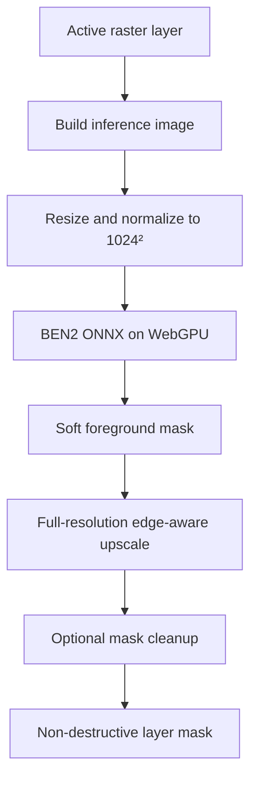

# LightTable Background Removal — BEN2 Base ONNX

## Implementatiestatus (13 augustus 2026)

De eerste LightTable-productimplementatie is afgerond:

- [x] één centrale `Remove Background`-command voor Select, Layer en het laag-contextmenu;
- [x] generieke `BackgroundRemovalModel`-boundary met BEN2 als productieadapter en BiRefNet Lite als benchmarkadapter;
- [x] BEN2-revision en FP16-artifactdigest vastgelegd in het modelprofiel;
- [x] model lazy-loaded bij de eerste opdracht; geen modelwerk tijdens app-startup;
- [x] WebGPU FP16 als voorkeursbackend en WASM q8 als expliciete lokale fallback;
- [x] decode, modeldownload, inferentie en full-resolution matte-refinement in een dedicated worker;
- [x] maximaal één actuele opdracht per controller, cancel door worker-disposal en stale-result-rejectie op document-, revision- en layer-id;
- [x] geïsoleerde GPU-export van de actieve rasterlaag inclusief eigen adjustments, zonder omliggende lagen of layer styles;
- [x] zachte output-alpha gecombineerd met bestaande source-alpha;
- [x] niet-destructieve editable layer-mask output met Replace, Intersect en New masked layer;
- [x] precies één undo-entry voor de uiteindelijke documentmutatie;
- [x] gepinde model/licentie opgenomen in de gegenereerde third-party inventory;
- [x] unit- en regressietests voor matte-refinement, maskmodi, rollback, undo en gedeelde menucommand;

De UX toont bewust geen model- of technische instellingen. Het model blijft warm in zijn worker voor snelle vervolgruns en wordt bij cancel of het sluiten van de editor expliciet vrijgegeven. Alleen het definitieve masker raakt de documentstate; progress-events veroorzaken geen compositor- of React-documentupdates.

De platformbrede BEN2-versus-BiRefNet kwaliteitsbenchmark uit het onderzoeksdeel hieronder blijft een releasekwalificatie, niet een tweede productpad of voorwaarde om de command te gebruiken. Een alternatieve adapter mag pas productiestatus krijgen nadat revision, artifactdigest en dezelfde kwaliteits-/memorytests zijn vastgelegd.

## Besluit

Voor een zelfstandige, volledig automatische **Remove Background**-functie in LightTable is **BEN2 Base ONNX** momenteel de beste eerste productiekandidaat.

Deze functie heeft geen SAM-prompt, click, box of handmatige objectkeuze nodig. Het model ontvangt één afbeelding en voorspelt automatisch een zachte foreground mask/alpha.

Voorgestelde productievariant:

- model: `onnx-community/BEN2-ONNX`;
- runtime: `@huggingface/transformers` / ONNX Runtime Web;
- preferred execution provider: WebGPU;
- modelbestand: FP16 ONNX, circa 219–223 MB;
- model input: `1 × 3 × 1024 × 1024`;
- output: éénkanaals foreground mask;
- licentie: MIT volgens de officiële BEN2-repository en modelpagina.

Officiële en relevante bronnen:

- [BEN2 officiële repository](https://github.com/PramaLLC/BEN2)
- [BEN2 officiële modelpagina](https://huggingface.co/PramaLLC/BEN2)
- [Transformers.js BEN2 ONNX-export](https://huggingface.co/onnx-community/BEN2-ONNX)
- [BEN2-paper](https://arxiv.org/abs/2501.06230)

## Waarom BEN2

BEN2 — Background Erase Network 2 — is specifiek ontworpen voor automatische foreground/background-scheiding. De architectuur gebruikt **Confidence Guided Matting**: moeilijkere of onzekere pixels krijgen extra refinement. Daardoor past het beter bij een `Remove Background`-knop dan een algemene prompt-based segmenter.

Sterke punten:

- geen user prompt nodig;
- gericht op algemene automatische background removal;
- soft mask-output in plaats van alleen een harde selectie;
- ontworpen met extra aandacht voor haar, fijne structuren en edge refinement;
- vaste 1024 × 1024-inference is eenvoudig te integreren;
- officiële ONNX-weights bestaan;
- een Transformers.js-ready ONNX-export bestaat;
- FP16-model is met ongeveer 219 MB acceptabel als optionele lokale modeldownload;
- MIT is geschikt voor opname in een closed-source commerciële applicatie, mits notices en exacte weight provenance worden vastgelegd.

## Belangrijke nuance

De publiek beschikbare weights zijn **BEN2 Base**. De makers spreken daarnaast over een uitgebreidere full-versie/API. Claims over de full-versie mogen niet automatisch worden toegeschreven aan de vrij beschikbare Base-weights.

Noem de ingebouwde functie daarom niet “BEN2 Full” en claim geen 4K-kwaliteit zonder eigen validatie. LightTable moet de daadwerkelijke ONNX-weights benchmarken die worden gedistribueerd.

## Waarom niet SAM 2.1

SAM 2.1 blijft geschikt voor **Select Object**:

- gebruiker klikt op het gewenste object;
- meerdere objecten kunnen gericht worden onderscheiden;
- positieve en negatieve punten corrigeren de selectie.

Voor een zelfstandige `Remove Background`-knop is SAM minder logisch:

- het model moet weten welk object gekozen moet worden;
- automatic mask generation kan meerdere concurrerende masks opleveren;
- SAM-output is primair segmentatie en geen volledige automatische mattingpipeline;
- haar, semi-transparantie en zachte dekking vereisen vaak extra refinement.

LightTable mag dus twee gescheiden functies hebben:

| Functie | Modelroute |
| --- | --- |
| **Remove Background** | BEN2 Base |
| **Select Object** | SAM 2.1, eventueel gevolgd door matte refinement |

## Waarom BEN2 boven BiRefNet Lite als eerste kandidaat

BiRefNet Lite blijft de belangrijkste alternatieve kandidaat en moet in de benchmark worden behouden. De keuze voor BEN2 als eerste implementatie komt door de combinatie van:

- expliciete focus op background removal;
- confidence-guided refinement;
- een actuele Transformers.js `background-removal`-pipeline;
- een geoptimaliseerde FP16 ONNX-export;
- vergelijkbare downloadgrootte met BiRefNet Lite.

BiRefNet Lite heeft sterke algemene foreground-segmentatie en is eveneens MIT-gelicenseerd. De gangbare community ONNX-export is 115 MB in FP16, maar er zijn recente meldingen dat de dynamische export in ONNX Runtime Web door `GatherND`/`ScatterND`-achtige paden veel geheugen kan gebruiken of `std::bad_alloc` kan veroorzaken. Er bestaat inmiddels een browser-tuned statische export, maar die is een recente third-party conversie en moet extra zorgvuldig worden gevalideerd.

Daarom:

1. implementeer de modelboundary met BEN2 als eerste backend;
2. benchmark BiRefNet Lite met exact dezelfde interface;
3. wissel alleen van standaardmodel als de LightTable-testset dat overtuigend ondersteunt.

## Productgedrag

### Menu en command

Voorgestelde entry points:

```text
Layer > Remove Background
Select > Remove Background
Layer context menu > Remove Background
```

Gebruik één centrale command:

```ts
removeBackgroundFromActiveLayer()
```

Alle UI-entry points moeten dezelfde command-, progress-, cancellation- en undo-route gebruiken.

### Standaard output

De functie moet:

- de huidige rasterlaag analyseren;
- automatisch een foreground alpha mask genereren;
- het resultaat als **niet-destructief layer mask** toepassen;
- originele RGB-pixels behouden;
- één undo-entry maken;
- bestaande transparantie respecteren.

De functie mag standaard geen pixels verwijderen en geen nieuwe flattened RGBA-laag maken.

### Bestaand mask

Als de laag al een mask heeft, toon een compacte keuze:

```text
This layer already has a mask.

(•) Replace mask
( ) Intersect with existing mask
( ) Add as new masked layer

[Cancel] [Apply]
```

De standaardkeuze mag `Replace mask` zijn, maar pas niets toe zonder expliciete bevestiging.

## UI-voorstel

Voor normale gebruikers hoort dit een one-click-functie te blijven:

```text
Removing background…
[████████░░] Refining edges

[Cancel]
```

Geen modelnaam, threshold of technische instellingen in de primaire flow.

Geavanceerde instellingen kunnen in een uitklapbaar gedeelte of Preferences staan:

```text
Remove Background

Quality       [Standard ▾]
Edge cleanup  [x]
Color cleanup [ ]

[Cancel] [Apply as Mask]
```

Aanbevolen eerste release:

- `Quality`: alleen `Standard`, nog niet zichtbaar;
- `Edge cleanup`: intern standaard aan;
- `Color cleanup`: nog niet implementeren totdat foreground color estimation goed werkt.

## Modelbeheer

BEN2 moet een optionele modeldownload zijn en niet noodzakelijk onderdeel van de basisinstaller.

Voorgesteld gedrag:

1. Gebruiker kiest voor het eerst `Remove Background`.
2. LightTable controleert de lokale modelregistry.
3. Indien afwezig verschijnt:

```text
Background Removal Model

Required download: approximately 220 MB
Runs locally. Images are not uploaded.

[Cancel] [Download and Continue]
```

4. Verifieer na download een vastgelegde SHA-256.
5. Installeer atomisch: eerst tijdelijk bestand, daarna rename naar de definitieve modelpath.
6. Start de originele command automatisch opnieuw.

Bewaar minimaal:

- interne model-id;
- publieke bron en exacte revision/commit;
- bestandsnaam;
- SHA-256;
- bestandsgrootte;
- input/output-contract;
- licentietekst en attribution;
- datum waarop de juridische en technische review is uitgevoerd.

Pin nooit alleen op `main`; pin de geteste modelrevision en checksum.

## Inferencepipeline



### 1. Inference image

Gebruik de pixels van de actieve laag zoals ze visueel binnen de relevante laagcontext moeten worden geïnterpreteerd. Leg expliciet vast of de functie werkt op:

- de oorspronkelijke laagpixels;
- de laag na non-destructive layer adjustments;
- of de zichtbare composited result.

Aanbevolen standaard: **de zichtbare pixels van de actieve laag inclusief eigen adjustments, maar zonder omliggende lagen**. Dit voorkomt dat BEN2 objecten uit andere lagen in het mask opneemt.

Bij een gedeeltelijk transparante bron:

- composite tijdelijk over een neutrale achtergrond voor RGB-inference;
- combineer de voorspelde alpha uiteindelijk met de bestaande source alpha;
- gebruik `finalAlpha = predictedAlpha * sourceAlpha`.

### 2. Resize

BEN2 gebruikt een vaste 1024 × 1024-input. Rek de afbeelding niet simpelweg zonder metadata terug te bewaren.

Ondersteun een van deze strategieën:

- exact resize naar 1024 × 1024 als dit overeenkomt met de officiële preprocessing;
- of aspect-preserving letterbox alleen wanneer tests aantonen dat de output minstens gelijkwaardig blijft.

Volg voor de eerste correcte referentie-implementatie exact de preprocessing van de gebruikte ONNX-export:

- RGB;
- rescale naar `[0, 1]`;
- ImageNet mean: `[0.485, 0.456, 0.406]`;
- ImageNet std: `[0.229, 0.224, 0.225]`;
- bilinear resize naar 1024 × 1024.

Voorkom dubbele rescale/normalize wanneer LightTable eigen preprocessing combineert met `AutoProcessor`.

### 3. Inference

Voorkeursroute:

```ts
import { pipeline } from '@huggingface/transformers';

const remover = await pipeline(
  'background-removal',
  LOCAL_BEN2_MODEL_PATH,
  {
    device: 'webgpu',
    dtype: 'fp16',
  },
);
```

Dit is illustratief. De coding agent moet de exacte Transformers.js-versie, lokale model-layout en API-signature in de huidige LightTable-codebase controleren.

Gebruik bij voorkeur een lagere-level `AutoModel`/session-route wanneer dat nodig is voor:

- hergebruik van bestaande GPU-resources;
- expliciete tensor lifecycle;
- progress/cancellation;
- directe mask-upload naar WebGPU;
- vermijden van canvas- of PNG-roundtrips.

### 4. Outputnormalisatie

Controleer het exacte outputcontract van de gepinde ONNX-export. Pas niet blind een sigmoid én min-max normalization toe.

Schrijf per modeladapter vast:

- output node name;
- logits of reeds genormaliseerde waarden;
- verwachte range;
- sigmoid vereist: ja/nee;
- min-max normalization vereist: ja/nee;
- channel/layout;
- orientation en resize mapping.

Een fout in deze stap kan masks visueel redelijk laten lijken maar edge-transparantie volledig veranderen.

## Full-resolution mask reconstructie

De 1024²-output mag niet simpelweg bilinear naar een 4K- of 8K-document worden vergroot en klaar zijn.

Aanbevolen reconstructie:

1. schaal de soft mask terug naar documentresolutie;
2. detecteer een edge/uncertainty band, bijvoorbeeld waar `0.02 < alpha < 0.98`;
3. vergroot deze band enkele pixels;
4. voer alleen daar edge-aware refinement uit met de originele RGB-pixels;
5. behoud zekere foreground/background buiten de band;
6. clamp naar `[0, 1]`;
7. bewaar het masker minimaal als `r16float` of equivalente 16-bit representatie.

Geschikte snelle GPU-postprocess:

- guided filter;
- joint bilateral upsampling;
- edge-aware feather met kleur/luminance guidance.

Deze postprocess verbetert alignment en aliasing, maar mag niet worden gepresenteerd als een tweede AI-mattingmodel. Hij kan geen haar reconstrueren dat BEN2 volledig heeft gemist.

## Edge cleanup

Pas conservatieve cleanup toe:

- verwijder alleen zeer kleine geïsoleerde background/foreground components;
- vul geen gaten die mogelijk onderdeel van het object zijn;
- vermijd globale blur;
- vermijd hard thresholden van de soft alpha;
- voorkom fringe door morphology alleen op confidence-regio's toe te passen.

Eventuele parameters moeten document- of outputpixel-gebaseerd zijn, niet afhankelijk van zoomniveau.

## Color contamination

BEN2 voorspelt primair een mask. Een goed mask verwijdert niet automatisch de kleur van de oude achtergrond uit halftransparante foreground-pixels.

Voorbeeld: blond haar tegen een blauwe achtergrond kan na compositing een blauwe rand houden.

Een latere `Decontaminate Colors`-functie moet daarom losstaan van mask inference:

- schat foreground edge colors;
- reduceer oude background spill;
- houd amount aanpasbaar;
- werk niet-destructief;
- verander het oorspronkelijke mask niet.

Dit is geen vereiste voor de eerste BEN2-integratie.

## Architectuur

Houd model, preprocessing, postprocessing en documentmutatie gescheiden.

```ts
type BackgroundRemovalBackend = 'webgpu' | 'wasm';

interface BackgroundRemovalRequest {
  source: ImageSource;
  sourceRevision: string;
  signal: AbortSignal;
}

interface BackgroundRemovalResult {
  alpha: MaskBuffer;
  modelId: string;
  modelRevision: string;
  inferenceSize: { width: number; height: number };
  timing: {
    preprocessingMs: number;
    inferenceMs: number;
    postprocessingMs: number;
  };
}

interface BackgroundRemovalModel {
  readonly id: string;
  readonly backend: BackgroundRemovalBackend;
  readonly supportsSoftAlpha: boolean;

  load(signal: AbortSignal): Promise<void>;
  removeBackground(
    request: BackgroundRemovalRequest,
  ): Promise<BackgroundRemovalResult>;
  unload(): Promise<void>;
}
```

Concrete adapters:

```text
Ben2BackgroundRemovalModel
BiRefNetLiteBackgroundRemovalModel  // benchmark/fallback
```

De UI en command layer mogen niet rechtstreeks afhankelijk zijn van BEN2.

## Threading en responsiveness

- Modeldownload buiten de renderthread.
- Preprocessing bij voorkeur GPU-based of in een worker.
- ONNX-inference mag de UI-eventloop niet blokkeren.
- Toon direct een cancelbare progress state.
- Controleer `AbortSignal` tussen preprocessing, inference en postprocessing.
- Als lopende ONNX-inference niet hard annuleerbaar is, negeer en dispose het resultaat zodra de signal aborted is.
- Pas documentmutatie alleen toe als document- en layerrevision nog overeenkomen met de request.

## Geheugenbeheer

BEN2 moet expliciet in de bestaande model-memorymanager van LightTable worden opgenomen.

Vereisten:

- maximaal één geladen background-removal-session per modeladapter;
- reuse input/output buffers waar veilig;
- dispose alle tijdelijke tensors;
- verwijder canvas/ImageBitmap-objecten na gebruik;
- houd geen extra full-resolution RGBA-kopie vast wanneer een GPU-texture volstaat;
- laat het model volgens een configureerbaar idlebeleid unloaden;
- rapporteer modelweights en tijdelijke tensorallocaties apart in diagnostics.

Test minimaal tien opeenvolgende background removals op grote documenten en controleer dat CPU RAM en GPU memory na garbage collection/resource disposal niet structureel blijven stijgen.

## Fallbackbeleid

Voorgestelde volgorde:

1. WebGPU FP16 BEN2;
2. WebGPU compatibele alternatieve BEN2-build indien nodig;
3. WASM/FP32 alleen wanneer geheugen en latency acceptabel zijn;
4. duidelijke foutmelding met mogelijkheid om model/backend te wisselen.

Voer niet stilzwijgend cloud-inference uit.

Een CPU/WASM FP32-model van circa 403 MB kan voor oudere hardware te zwaar zijn. Test dit voordat het als algemene fallback wordt aangeboden.

## Benchmark vóór definitieve activatie

BEN2 is de beste eerste kandidaat, maar de definitieve standaard moet evidence-based worden bevestigd tegen **BiRefNet Lite**.

### Testbeelden

Gebruik minimaal:

- portretten met donker, blond, krullend en kroeshaar;
- huisdieren, vacht en veren;
- producten op egale en drukke achtergronden;
- witte objecten op witte achtergrond;
- zwarte objecten op donkere achtergrond;
- planten, takjes, kabels en fietsspaken;
- stoelen en objecten met interne openingen;
- glas, plastic en doorschijnende stof;
- motion blur en geringe scherptediepte;
- meerdere opvallende objecten;
- kleine foreground subjects;
- illustraties en 3D-renders.

### Vergelijkingsmodellen

- BEN2 Base ONNX FP16;
- BiRefNet Lite ONNX FP16;
- optioneel full BiRefNet als offline kwaliteitsreferentie;
- huidige LightTable-baseline.

### Kwaliteitsmetrieken

Met ground-truth alpha:

- SAD;
- MSE;
- gradient error;
- connectivity error.

Zonder ground truth:

- blind visual review;
- composite op wit, zwart, rood, groen en blauw;
- inspectie op 100% en 400%;
- score voor subject completeness;
- score voor halo/fringe;
- score voor false foreground/background.

### Performancemetrieken

- cold model load time;
- warm inference time;
- preprocessing en postprocessing afzonderlijk;
- peak CPU RAM;
- peak GPU memory;
- eerste run versus herhaalde runs;
- Windows/NVIDIA, macOS/Apple Silicon en geïntegreerde GPU;
- failure rate en backend fallback.

## Acceptatiecriteria

- Eén actie genereert automatisch een foreground mask zonder prompts.
- Output wordt als editable, niet-destructief layer mask toegepast.
- Soft alpha blijft behouden; geen onbedoelde binary threshold.
- Bestaande source alpha wordt correct gecombineerd.
- UI blijft responsive en operatie is annuleerbaar.
- Geen documentmutatie na cancel of stale documentrevision.
- Model werkt offline na de eerste download.
- Exacte modelrevision, checksum en license notice zijn vastgelegd.
- Tien herhaalde runs veroorzaken geen structurele CPU/GPU-memorygroei.
- BEN2 verslaat de huidige baseline overtuigend op de afgesproken LightTable-testset.
- BEN2 en BiRefNet Lite worden via dezelfde adapterinterface getest.

## Implementatievolgorde

1. Maak de generieke `BackgroundRemovalModel`-boundary.
2. Voeg lokale modelregistry, download, revision pinning en checksum toe.
3. Implementeer BEN2-preprocessing exact volgens het gepinde model.
4. Draai BEN2 via WebGPU FP16 en valideer outputnormalisatie.
5. Pas output toe als non-destructive layer mask.
6. Voeg full-resolution edge-aware upsampling toe.
7. Voeg cancellation, stale-result protection en diagnostics toe.
8. Bouw een BiRefNet Lite-adapter voor de A/B-benchmark.
9. Test kwaliteit, latency en memory op de ondersteunde platformen.
10. Activeer BEN2 als default als de acceptatiecriteria zijn gehaald.

## Eindadvies

Start voor LightTable met **BEN2 Base ONNX FP16** als model achter `Remove Background`.

Het is momenteel de beste combinatie van:

- automatische one-click werking;
- foreground/matting-gerichte architectuur;
- edge refinement;
- lokale Transformers.js/ONNX-integratie;
- acceptabele modelgrootte;
- commercieel bruikbare MIT-licentie.

Houd **BiRefNet Lite** direct achter dezelfde modelinterface als benchmark en fallback. De modelkeuze blijft vervangbaar; de LightTable UX, layer-mask-output en commandarchitectuur mogen niet aan BEN2 vastzitten.
