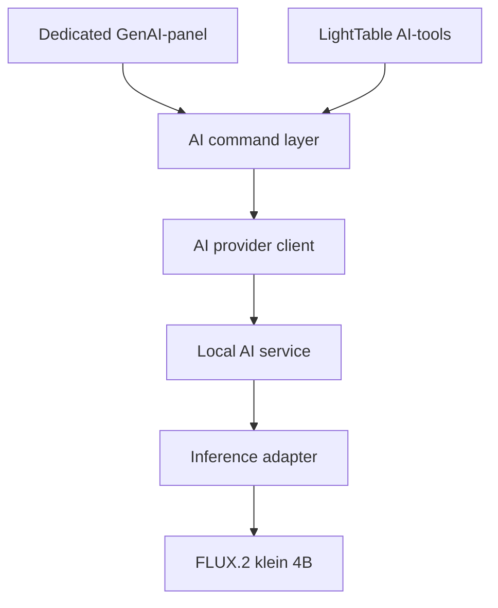
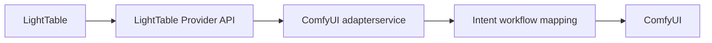

# LightTable Local AI Provider — eerste implementatie

**Status:** voorstel voor eerste implementatie  
**Primaire platforms:** Windows x64 en macOS Apple Silicon  
**Eerste modelservice:** FLUX.2 [klein] 4B distilled (Apache 2.0)  
**Hoofddoel:** lokale AI-modellen kunnen vervangen en toevoegen zonder een nieuwe LightTable-release.

## 1. Doel

LightTable krijgt een kleine, stabiele AI-providerlaag tussen de applicatie en lokale of externe AI-services. De **eerste concrete vertical slice** is geen abstract providerframework zonder werkend model: hij moet FLUX.2 [klein] 4B distilled daadwerkelijk lokaal als zelfstandige service laten draaien en via de eigen LightTable Provider API bruikbaar maken. Tegelijk mag LightTable nergens rechtstreeks afhankelijk worden van FLUX, Diffusers, ComfyUI of `stable-diffusion.cpp`.

Een toekomstige modelprovider moet zelfstandig kunnen worden uitgebracht. Als die dezelfde versioned API implementeert, moet een gebruiker hem in Preferences kunnen toevoegen en direct vanuit het bestaande GenAI-panel kunnen gebruiken.

De eerste implementatie moet:

- op Windows x64 en macOS Apple Silicon werken;
- een lokale, losstaande AI-service via HTTP kunnen aanspreken;
- provideradres en poort configureerbaar maken;
- capabilities en helpinformatie bij de provider opvragen;
- Image Create en Image Edit ondersteunen;
- een base image, nul of meer reference images en optioneel een selection mask kunnen versturen;
- één of meer gegenereerde images terugontvangen;
- asynchrone jobs, voortgang, fouten en annuleren ondersteunen;
- resultaten via de bestaande LightTable document/layer-architectuur importeren;
- aansluiten op het bestaande dedicated GenAI-panel;
- later door tools zoals Remove Object en Generative Fill hergebruikt kunnen worden.

### Eerste succescriterium in één zin

Op Windows en macOS kan LightTable een losse FLUX.2 [klein] 4B-service starten of verbinden, via `/api/v1/capabilities` ontdekken wat die kan, vanuit het bestaande GenAI-panel een create/edit-job sturen en de teruggegeven image als document of layer importeren.

### KV-variant: belangrijke afbakening

Er bestaat op dit moment geen officiële FLUX.2 [klein] **4B KV** checkpoint van Black Forest Labs. De officiële KV-geoptimaliseerde checkpoint is **FLUX.2 [klein] 9B KV**. Deze gebruikt de FLUX Non-Commercial License en is daarom niet geschikt als standaard meegeleverde modelservice in een commerciële LightTable-release zonder aanvullende commerciële rechten.

Daarom geldt:

- eerste distributiedoel: FLUX.2 [klein] 4B distilled, Apache 2.0;
- eerste mogelijke optimalisatie: officiële 4B FP8 of een zorgvuldig gevalideerde quantization;
- 9B KV: alleen als aparte experimentele/user-supplied provider of na passende commerciële licentie;
- toekomstige officiële commerciële 4B KV: moet via dezelfde provider-API toegevoegd kunnen worden zonder LightTable opnieuw te bouwen;
- custom KV-caching op 4B is technisch onderzoek en mag niet als officiële 4B KV-variant worden gepresenteerd.

## 2. Expliciet niet in de eerste milestone

Deze zaken moeten in het ontwerp mogelijk blijven, maar blokkeren versie 1 niet:

- Linux-distributie;
- automatische UI-generatie voor iedere modelspecifieke instelling;
- meerdere gelijktijdige GPU-jobs;
- LoRA-management;
- ControlNet en andere controls;
- cloud-authenticatie en accountbeheer;
- automatische installatie van onbekende community-providers;
- een publieke provider marketplace;
- generative layers met live herberekening;
- volledige OpenAPI-codegeneratie.

## 3. Kernprincipes

### 3.1 LightTable bepaalt het contract

De publieke provider-API is van LightTable. Een backend zoals `stable-diffusion.cpp` wordt achter een adapter geplaatst. Backendupdates mogen het LightTable-contract niet direct veranderen.

### 3.2 De provider is self-describing

LightTable kent vooraf alleen de protocolversie en de discovery-endpoints. De provider publiceert zelf:

- identiteit en versie;
- ondersteunde operaties;
- modellen;
- inputmogelijkheden;
- formaten en limieten;
- optionele modelinstellingen;
- helpinformatie.

### 3.3 De command layer blijft model-onafhankelijk

Het GenAI-panel, Remove Object, Generative Fill, Agent, MCP en toekomstige scripts roepen dezelfde LightTable AI-command layer aan. Zij mogen geen provider-HTTP of FLUX-parameters bevatten.

### 3.4 Resultaten zijn standaard niet-destructief

Een AI-resultaat wordt standaard als nieuwe layer of nieuw document geïmporteerd. Prompt, seed, provider, model, bronlagen, references en gebruikte selection worden als generation metadata opgeslagen.

### 3.5 Eén stabiele eerste route

Implementeer eerst één provider, één job tegelijk en twee operaties: `image.create` en `image.edit`. Breid pas daarna uit.

## 4. Architectuur



Aanbevolen interne modules:

```text
src/
  ai/
    domain/
      AiProvider.ts
      AiCapabilities.ts
      AiJob.ts
      AiRequest.ts
      AiResult.ts
    application/
      AiProviderRegistry.ts
      AiCommandService.ts
      AiJobController.ts
      AiAssetExporter.ts
      AiResultImporter.ts
    infrastructure/
      http/
        HttpAiProvider.ts
        AiProviderProtocolV1.ts
        AiProviderValidator.ts
      process/
        LocalAiProcessManager.ts
    ui/
      provider-settings/
      genai-integration/
```

Pas namen en locaties aan de bestaande LightTable-boundaries aan. Vermijd een tweede losstaande state-architectuur wanneer de huidige command layer en stores dit al oplossen.

## 5. Providerconfiguratie

Sla providerconfiguratie apart op van modelcapabilities. Capabilities komen altijd live van de provider en zijn geen handmatig onderhouden LightTable-data.

```ts
export interface AiProviderConfig {
  id: string;
  displayName: string;
  enabled: boolean;

  transport: {
    type: "http";
    baseUrl: string;
    apiToken?: string;
    timeoutMs: number;
  };

  localProcess?: {
    autoStart: boolean;
    executablePath?: string;
    args?: string[];
  };

  defaults?: {
    createModelId?: string;
    editModelId?: string;
  };
}
```

Voorbeelden:

```text
Free Local AI
http://127.0.0.1:7862

Custom Local Provider
http://127.0.0.1:9000
```

### Preferences UI — eerste versie

Voeg onder AI Providers minimaal toe:

- providernaam;
- enabled;
- base URL inclusief configureerbare poort;
- optioneel API-token;
- Auto Start voor meegeleverde lokale services;
- Test Connection;
- Refresh Capabilities;
- Open API Help;
- standaardprovider voor Image Create;
- standaardprovider voor Image Edit;
- Add Provider en Remove Provider.

Valideer dat HTTP-services zonder expliciete toestemming alleen via loopback (`127.0.0.1` of `localhost`) worden gebruikt. Voor externe adressen moet LightTable duidelijk tonen dat images de computer verlaten.

## 6. Protocolversie 1

Gebruik als prefix:

```text
/api/v1
```

Verplichte endpoints:

```http
GET  /api/v1/health
GET  /api/v1/capabilities
GET  /api/help
POST /api/v1/jobs
GET  /api/v1/jobs/{jobId}
GET  /api/v1/jobs/{jobId}/result
POST /api/v1/jobs/{jobId}/cancel
```

Optioneel in versie 1:

```http
GET /api/v1/jobs/{jobId}/events
GET /api/help/openapi.json
```

Wanneer Server-Sent Events nog niet stabiel beschikbaar zijn, mag LightTable jobstatus pollen. Houd de client zo dat polling later door SSE vervangen kan worden.

### 6.1 Health

```json
{
  "status": "ready",
  "protocolVersion": "1.0",
  "providerVersion": "0.1.0",
  "modelLoaded": true
}
```

Toegestane statussen:

- `starting`
- `downloading`
- `loading-model`
- `ready`
- `busy`
- `error`

### 6.2 Capabilities

```ts
export interface AiProviderCapabilitiesV1 {
  protocol: {
    name: "lighttable-ai-provider";
    version: "1.0";
  };

  provider: {
    id: string;
    name: string;
    version: string;
  };

  operations: Array<"image.create" | "image.edit" | "image.inpaint">;

  intents?: Array<{
    id: string;
    name: string;
    supportedOperations: Array<"image.create" | "image.edit" | "image.inpaint">;
  }>;

  input: {
    supportsBaseImage: boolean;
    supportsReferences: boolean;
    maxReferences: number;
    supportsSelectionMask: boolean;
    selectionMaskFormats: Array<"alpha" | "grayscale">;
    supportedMimeTypes: string[];
  };

  output: {
    supportedMimeTypes: string[];
    supportsAlpha: boolean;
    maxImagesPerJob: number;
  };

  limits: {
    minWidth: number;
    minHeight: number;
    maxWidth: number;
    maxHeight: number;
    dimensionMultiple?: number;
  };

  models: AiProviderModelCapability[];
}
```

Een model capability bevat minimaal:

```ts
export interface AiProviderModelCapability {
  id: string;
  name: string;
  operations: Array<"image.create" | "image.edit" | "image.inpaint">;
  settings?: Record<string, unknown>;
}
```

Voor `settings` mag de provider een beperkte JSON-Schema-subset publiceren. De eerste LightTable-versie hoeft alleen deze types te renderen:

- integer;
- number;
- boolean;
- enum/string;
- seed;
- aspect ratio;
- output resolution.

Onbekende instellingen worden genegeerd en gelogd, niet als fatale protocolfout behandeld.

## 7. Jobrequest

Gebruik `multipart/form-data`. Het JSON-request gaat in het veld `request`; images gaan in afzonderlijke binary parts. Vermijd Base64-images in JSON.

```ts
export interface AiImageJobRequestV1 {
  operation: "image.create" | "image.edit" | "image.inpaint";
  intent: AiImageIntent;
  modelId: string;
  prompt: string;

  output: {
    width: number;
    height: number;
    count: number;
    mimeType: "image/png" | "image/webp";
    includeAlpha: boolean;
  };

  seed?: number;
  baseImage?: AiMultipartImageRef;
  references?: AiReferenceRequest[];
  selection?: AiSelectionRequest;

  modelSettings?: Record<string, unknown>;

  clientMetadata?: {
    documentId?: string;
    commandId?: string;
  };
}

export type AiImageIntent =
  | "general-create"
  | "general-edit"
  | "remove-object"
  | "generative-fill"
  | "replace-object"
  | "replace-background"
  | "expand-canvas"
  | "create-variation"
  | `custom:${string}`;

export interface AiMultipartImageRef {
  field: string;
  mimeType: string;
}

export interface AiReferenceRequest {
  id: string;
  image: AiMultipartImageRef;
  role?: "visual" | "style" | "character" | "composition";
}

export interface AiSelectionRequest {
  mask: AiMultipartImageRef;
  format: "alpha" | "grayscale";
  interpretation: "alpha-is-selected" | "white-is-selected";
  featherRadiusPx?: number;
}
```

Multipartvoorbeeld:

```text
request       application/json
base_image    image/png
reference_0   image/png
reference_1   image/png
selection     image/png
```

De provider moet inputvolgorde uit het JSON-request halen en niet vertrouwen op de multipartvolgorde.

### Operation versus intent

`operation` beschrijft het technische minimum dat LightTable van de provider vraagt. `intent` beschrijft het gebruikersdoel.

Voorbeeld:

```json
{
  "operation": "image.inpaint",
  "intent": "remove-object",
  "prompt": "Remove the selected object and reconstruct the background"
}
```

Dit onderscheid is belangrijk voor toekomstige adapterservices. Een eenvoudige FLUX-service kan meerdere intents naar dezelfde inference-call mappen. Een ComfyUI-tussenservice kan op basis van `intent` juist een andere workflow, nodes, prompttemplate, mask preprocessing of compositingstrategie kiezen.

LightTable blijft eigenaar van de gestandaardiseerde intents. Providers mogen aanvullende intents publiceren met een namespaced identifier:

```text
custom:com.example.product-relight
```

Regels:

- stuur altijd een intent mee;
- gebruik geen vrij geformuleerde displaynaam als machine-id;
- de provider mag de intent optimaliseren, maar niet stilzwijgend een ander gebruikersdoel uitvoeren;
- een onbekende standaardintent mag generiek worden afgehandeld wanneer de bijbehorende `operation` wordt ondersteund;
- een onbekende `custom:` intent moet met `OPERATION_UNSUPPORTED` worden geweigerd;
- modelspecifieke workflowvelden horen in `modelSettings`, niet in de intentnaam;
- LightTable bewaart operation én intent in generation metadata.

### Eerste implementatieregel

Voor `image.create` zijn alleen prompt en output verplicht. Voor `image.edit` is een base image verplicht. References en selection zijn optioneel en worden alleen aangeboden wanneer de capability dit ondersteunt.

## 8. Jobs en resultaten

Startresponse:

```json
{
  "jobId": "job_01JXYZ",
  "status": "queued"
}
```

Jobstatus:

```ts
export interface AiJobStatusV1 {
  jobId: string;
  status:
    | "queued"
    | "loading-model"
    | "running"
    | "completed"
    | "cancelled"
    | "failed";
  progress?: number;
  phase?: string;
  error?: {
    code: string;
    message: string;
    retryable: boolean;
  };
}
```

Resultaat:

```ts
export interface AiJobResultV1 {
  jobId: string;
  images: Array<{
    id: string;
    url: string;
    mimeType: string;
    width: number;
    height: number;
    hasAlpha: boolean;
  }>;
  generation: {
    providerId: string;
    providerVersion: string;
    modelId: string;
    seed?: number;
    durationMs?: number;
  };
}
```

Resultaat-URL's mogen alleen onder dezelfde provider-origin liggen. LightTable accepteert geen willekeurige redirect of onverwachte externe URL vanuit een lokale provider.

## 9. Dedicated GenAI-panel

Het bestaande panel blijft leidend. Vervang de huidige directe provider/modelkoppeling door data uit `AiProviderRegistry`.

### Bij openen van het panel

1. Lees de gekozen provider uit Preferences.
2. Vraag gecachte capabilities op.
3. Doe indien nodig een refresh.
4. Vul de modeldropdown met modellen die de actieve mode ondersteunen.
5. Schakel UI-elementen in of uit op basis van capabilities.

### Mapping bestaande UI

| GenAI-panel | Providerrequest |
| --- | --- |
| Image Create | `image.create` |
| Image Edit | `image.edit` |
| Modeldropdown | `modelId` |
| Visual references | `references[]` |
| Add base image | `baseImage` |
| Prompt | `prompt` |
| Aspect ratio | output width/height |
| Resolutie | output width/height |
| Aantal | output count |
| Generate | `POST /api/v1/jobs` |

Toon provider en model afzonderlijk. Een modelnaam is geen provideridentiteit.

### Base image

Ondersteun aanvankelijk twee bronnen:

- actieve layer;
- visible composite van het huidige document.

Render naar een tijdelijke PNG in sRGB. Bewaar intern welke document/layers de input vormden.

### Visual references

Herbruik het bestaande reference-vak. Respecteer `maxReferences`. Iedere reference wordt als afzonderlijke PNG-part verstuurd. Houd de bestaande `@asset`-resolutie aan de LightTable-kant; een provider hoeft LightTable-projecten niet te kennen.

### Resultaatimport

Bij voltooiing:

1. download of lees het resultaat;
2. valideer mime type, bestandsgrootte en dimensions;
3. decodeer via de bestaande LightTable image pipeline;
4. maak een nieuwe layer of een nieuw document;
5. voeg generation metadata toe;
6. registreer dit als één undoable command;
7. verwijder tijdelijke bestanden zodra zij niet meer nodig zijn.

## 10. Selection en alpha mask

Neem selection vanaf de eerste protocolversie mee, ook als FLUX-integratie dit pas in fase 2 gebruikt.

Standaardiseer intern:

- exact dezelfde pixelafmetingen als de base image of geëxporteerde crop;
- 8-bit PNG;
- wit/alpha 255 betekent geselecteerd;
- zwart/alpha 0 betekent niet geselecteerd;
- feathering wordt bij voorkeur door LightTable in het masker gebakken;
- de interpretation staat altijd expliciet in het request.

Stuur voor grote documenten later alleen selection bounds plus context padding. Optimaliseer dit niet voordat full-frame editing correct werkt.

## 11. Remove Object — voorbereiden, nog niet als eerste feature

Remove Object wordt later een dun commando boven dezelfde providerlaag:

```ts
aiCommandService.execute({
  operation: "image.inpaint",
  intent: "remove-object",
  baseImage: { source: "visible-composite" },
  selection: { source: "current-selection" },
  prompt: "Remove the selected object and reconstruct the background",
  destination: "new-layer"
});
```

Als een provider geen `image.inpaint` publiceert:

- bied de functie niet aan; of
- gebruik alleen na expliciete implementatie een LightTable fallback naar `image.edit`.

Maak geen stilzwijgende fallback die onverwacht het hele beeld verandert.

## 12. Lokale FLUX.2 Klein 4B-service — primaire implementatiefocus

De eerste service is het primaire resultaat van deze implementatie en draait als apart executable/process:

```text
LightTable
└── LightTable Local AI Service
    └── FLUX.2 klein 4B inference runtime
```

Aanbevolen eerste backend: een gepinde, zelf gebouwde versie van `stable-diffusion.cpp`, geplaatst achter de LightTable provideradapter. Het project ondersteunt FLUX.2 Klein, CUDA, Metal, Windows en macOS en is MIT-gelicenseerd. Houd de adaptergrens expliciet omdat de upstream server-API nog verandert. Als deze backend FLUX.2 Klein editing, multi-reference, Metal of cancellation niet betrouwbaar genoeg uitvoert, mag de eerste service intern tijdelijk een andere inference-implementatie gebruiken; de publieke LightTable API blijft gelijk.

De eerste technische spike moet niet alleen een mockserver opleveren, maar deze end-to-end keten bewijzen:

```text
LightTable request
→ LightTable Provider API
→ FLUX.2 Klein 4B model load
→ 4-step inference
→ PNG-resultaat
→ LightTable layer/document import
```

De modelservice bevat:

- protocolserver;
- requestvalidatie;
- één jobqueue;
- model lifecycle;
- inference adapter;
- tijdelijke input/outputopslag;
- structured logging;
- graceful shutdown.

### Modelcomponenten

Voor de eerste officiële package:

- FLUX.2 [klein] 4B distilled;
- Qwen3-4B text encoder;
- FLUX.2 decoder, mogelijk de officiële Small Decoder na kwaliteitstest;
- eigen manifest met URLs, bestandsgroottes, SHA-256 hashes en licentieverwijzingen.

FLUX.2 [klein] 4B, de officiële 4B FP8-variant, Qwen3-4B en de officiële Small Decoder zijn Apache 2.0. FLUX.2 [klein] 9B en 9B KV mogen niet als commerciële equivalenten worden meegeleverd; die gebruiken een non-commercial licentie.

### KV-onderzoek na de eerste werkende 4B-service

Zodra 4B create/edit stabiel werkt, voer een aparte spike uit:

1. meet multi-reference editing met normale 4B;
2. bepaal of de gekozen runtime reference embeddings of KV-data veilig kan hergebruiken;
3. vergelijk resultaatkwaliteit en geheugen met de normale pipeline;
4. houd caching volledig intern aan de service;
5. verander het publieke protocol alleen wanneer expliciete cache sessions aantoonbaar nodig zijn.

KV-caching is een runtime-optimalisatie en geen eigenschap waarop het GenAI-panel hard mag coderen. Een provider kan later bijvoorbeeld `optimizations: ["reference-kv-cache"]` publiceren.

## 13. Process lifecycle

### Meegeleverde provider

1. LightTable controleert health.
2. Indien niet bereikbaar en Auto Start actief is, start `LocalAiProcessManager` de service.
3. De service kiest de geconfigureerde poort of retourneert een vrije poort via startup handshake.
4. LightTable wacht beperkt op `starting`, `loading-model` en `ready`.
5. Bij sluiten vraagt LightTable graceful shutdown.
6. Als de service extern gestart is, sluit LightTable hem niet af.

Gebruik bij een automatisch gestarte service een willekeurig session-token. Bind standaard uitsluitend aan loopback.

### Custom provider

LightTable start een custom provider in versie 1 niet automatisch, tenzij de gebruiker expliciet een executable configureert. Een falende provider mag LightTable niet laten crashen of het openen van een document blokkeren.

## 14. Windows-build

Eerste supported target:

```text
Windows 11 x64
NVIDIA CUDA
```

Daarna eventueel Vulkan voor AMD/Intel.

Package:

```text
resources/ai-runtime/win32-x64/
  lighttable-ai-service.exe
  runtime libraries
  THIRD_PARTY_LICENSES.txt
```

Eisen:

- geen aparte Python-installatie;
- geen administratorrechten voor normaal gebruik;
- modelbestanden buiten de app-installatiedirectory;
- lange modeldownloads resumable;
- SHA-256-controle vóór activatie;
- duidelijke fout bij ontbrekende of incompatibele GPU-driver;
- child-process output naar een geroteerd logbestand.

## 15. macOS-build

Eerste supported target:

```text
macOS Apple Silicon arm64
Metal
```

Package:

```text
Resources/ai-runtime/darwin-arm64/
  lighttable-ai-service
  THIRD_PARTY_LICENSES.txt
```

Eisen:

- service meenemen in signing en notarization;
- geen executable downloaden en stil uitvoeren zonder geldige verificatie;
- modelweights opslaan in Application Support, niet in de app bundle;
- rekening houden met unified memory;
- Intel Mac in de eerste milestone expliciet als unsupported of experimental markeren;
- service als child process draaien, niet direct als permanente daemon installeren.

## 16. Model- en service-updates zonder LightTable-release

Maak onderscheid tussen:

1. **LightTable providerprotocol** — langzaam veranderend en versioned;
2. **AI service** — onafhankelijk updatebaar;
3. **model package** — onafhankelijk downloadbaar/vervangbaar.

Een package manifest kan later dit formaat gebruiken:

```json
{
  "packageId": "lighttable-flux2-klein-4b",
  "version": "1.0.0",
  "protocolVersion": "1.0",
  "platform": "win32-x64",
  "service": {
    "file": "lighttable-ai-service.exe",
    "sha256": "..."
  },
  "models": [
    {
      "id": "flux-2-klein-4b",
      "files": [
        { "name": "model.safetensors", "sha256": "...", "size": 0 }
      ]
    }
  ]
}
```

Gebruik ondertekende manifests voordat automatische remote updates worden ingeschakeld. Community-providers worden in eerste instantie handmatig toegevoegd via URL; LightTable installeert geen willekeurige binaries.

## 17. Foutafhandeling

Definieer stabiele foutcodes:

```text
PROVIDER_UNREACHABLE
PROTOCOL_VERSION_UNSUPPORTED
CAPABILITIES_INVALID
MODEL_NOT_INSTALLED
MODEL_LOAD_FAILED
GPU_UNSUPPORTED
OUT_OF_MEMORY
INVALID_REQUEST
INPUT_TOO_LARGE
OPERATION_UNSUPPORTED
JOB_CANCELLED
INFERENCE_FAILED
RESULT_INVALID
```

UI-meldingen moeten een korte gebruikersmelding en optionele technische details hebben. Log geen API-tokens en kopieer prompts of persoonlijke images niet onnodig naar globale logs.

Bij `OUT_OF_MEMORY` kan de UI later voorstellen:

- kleinere resolutie;
- lagere output count;
- andere provider;
- model unload/retry.

Voer in versie 1 geen automatische kwaliteitsverlagende retry uit zonder dit aan de gebruiker te tonen.

## 18. Security

Minimale eisen:

- lokale service bindt alleen aan `127.0.0.1`;
- random bearer token per automatisch gestarte sessie;
- maximaal toegestane multipartgrootte;
- mime type én file signature valideren;
- image dimensions vóór volledige allocatie controleren;
- resultaat-URL op origin valideren;
- tijdelijke bestandsnamen randomiseren;
- nooit user paths rechtstreeks uit remote providerresponses uitvoeren;
- geen shell commandstrings bouwen uit providerinstellingen;
- providerresponses behandelen als onbetrouwbare input;
- externe provider duidelijk labelen als upload naar een externe service.

## 19. Testing

### Contracttests

Maak een kleine fake provider die alle protocolroutes implementeert zonder model. Gebruik deze voor CI en UI-tests.

Test minimaal:

- capabilities geldig/ongeldig;
- onbekende capabilityvelden;
- protocolversie mismatch;
- create zonder images;
- edit met base image;
- meerdere references in correcte volgorde;
- alpha- en grayscale-selection;
- progress polling;
- cancel;
- timeout;
- provider offline;
- invalid result image;
- te grote dimensions;
- resultaatimport als één undoable command.

### Runtime golden tests

Voor iedere gepinde service/modelcombinatie:

- vaste prompts;
- vaste seeds;
- vaste inputimages;
- create, edit en later selection edit;
- outputdimensions en alpha;
- crash- en memorytest over herhaalde jobs;
- visuele quality baseline met toleranties, niet alleen exacte filehashes.

Test Windows CUDA en macOS Metal afzonderlijk. Ga niet uit van pixel-identieke outputs tussen backends.

## 20. Implementatiefasen

### Fase 0 — protocol en fake provider

- [x] TypeScript domain types definiëren.
- [x] JSON Schema voor protocol v1 vastleggen.
- [x] Fake provider bouwen.
- [x] Provider client plus runtimevalidatie bouwen.
- [x] Contracttests toevoegen.

**Exit:** LightTable kan capabilities lezen, een fake job starten, progress tonen, annuleren en een test-PNG importeren.

### Fase 1 — Preferences en GenAI-panel

- [x] `AiProviderRegistry` implementeren.
- [ ] provider CRUD in Preferences.
- [x] configureerbare host/poort en testknop.
- [x] standaardprovider per Create/Edit.
- [x] GenAI-modeldropdown vanuit capabilities vullen.
- [x] prompt, resolutie, count en references mappen.
- [x] base image exporteren.
- [x] output als layer/document importeren.

**Exit:** het bestaande GenAI-panel werkt volledig tegen de fake provider zonder provider-specifieke code.

### Fase 2 — Windows FLUX-service

- [x] gepinde native inferencebackend bouwen.
- [x] FLUX.2 Klein 4B distilled adapter als primaire vertical slice.
- [x] CUDA hardwaredetectie.
- [x] model manifest/download/validatie.
- [x] process lifecycle en session-token.
- [x] create en edit end-to-end.
- [x] memory- en cancellationtests.
- [ ] na werkende baseline: FP8/quantization vergelijken.

**Exit:** een normale Windows-gebruiker kan Free Local AI installeren en vanuit het GenAI-panel genereren en editen.

### Fase 3 — macOS FLUX-service

- [ ] arm64/Metal runtime bouwen.
- [ ] signing en notarization.
- [ ] modelpad en permissions.
- [ ] unified-memory grenzen meten.
- [ ] create/edit golden tests.

**Exit:** dezelfde provider-API werkt op een ondersteunde Apple Silicon Mac zonder wijzigingen in het GenAI-panel.

### Fase 3B — optioneel KV- en reference-cacheonderzoek

- [ ] bevestigen dat normale 4B baseline correct en reproduceerbaar is;
- [ ] custom reference/KV-caching uitsluitend achter de serviceadapter onderzoeken;
- [ ] performance, VRAM en fidelity benchmarken;
- [ ] 9B KV alleen testen als user-supplied/non-commercial development provider;
- [ ] geen 9B KV-weights met commerciële LightTable-build distribueren.

**Exit:** caching kan als interne provideroptimalisatie worden geactiveerd zonder wijzigingen aan LightTable of het basisprotocol.

### Fase 4 — selection en Remove Object

- [ ] current selection als PNG-mask exporteren.
- [ ] selection plus base image versturen.
- [ ] selection-resultaat correct positioneren.
- [ ] context crop/padding optimalisatie.
- [ ] Remove Object command aansluiten.
- [ ] undo/history en metadata verifiëren.

**Exit:** Remove Object gebruikt dezelfde providerlaag en levert een niet-destructieve resultaatlayer.

### Fase 5 — derde provider bewijst pluggability

- [ ] eenvoudige voorbeeldprovider buiten LightTable bouwen.
- [ ] uitsluitend via de gepubliceerde API verbinden.
- [ ] provider vervangen zonder LightTable opnieuw te bouwen.
- [ ] provider SDK/documentatie publiceren.

**Exit:** een nieuw model of andere inference-stack kan als losse service worden geïnstalleerd en via Preferences worden geselecteerd.

## 21. Definition of Done voor de eerste release

- LightTable bevat geen FLUX-specifieke logica buiten de provider/service-adapter.
- De bestaande GenAI-UI werkt via de generieke command layer.
- Een provider kan via URL en poort worden gewijzigd.
- `/api/v1/capabilities` en `/api/help` zijn beschikbaar.
- Create en Edit ondersteunen prompt, base image en multiple references.
- Het protocol accepteert een selection mask, ook als niet ieder model dit ondersteunt.
- Jobs kunnen worden gevolgd en geannuleerd.
- Resultaten worden veilig en niet-destructief geïmporteerd.
- Windows CUDA en macOS Metal hebben afzonderlijke releasechecks.
- Service en model kunnen onafhankelijk van LightTable worden vervangen.
- Alle meegeleverde componenten hebben license notices en vaste hashes.

## 22. Belangrijke technische keuzes voor de coding agent

De coding agent moet eerst de bestaande command layer, document/layer-import, Preferences-store, GenAI-providercode en process-management bekijken. Gebruik bestaande boundaries waar die geschikt zijn.

Vrijheid blijft bestaan voor:

- concrete map- en klassennamen;
- gebruikte HTTP-library;
- polling versus SSE in de eerste versie;
- tijdelijke bestanden versus streaming voor lokale inputs;
- exacte packagingtool;
- native service-implementatietaal;
- Small Decoder versus volledige decoder na benchmark.

Niet vrij wijzigen zonder protocolbesluit:

- model-onafhankelijke command boundary;
- versioned providerprotocol;
- capability discovery;
- async jobmodel;
- expliciete base/reference/selection inputs;
- afzonderlijke technische `operation` en semantische `intent`;
- provider configureerbaar buiten een LightTable-release;
- veilige, niet-destructieve resultaatimport.

## 23. Bronnen en licenties

- [BFL FLUX.2 Klein productpagina](https://bfl.ai/models/flux-2-klein)
- [FLUX.2 Klein 4B modelkaart](https://huggingface.co/black-forest-labs/FLUX.2-klein-4B)
- [FLUX.2 Klein 4B FP8](https://huggingface.co/black-forest-labs/FLUX.2-klein-4b-fp8)
- [FLUX.2 Klein 9B KV — non-commercial](https://huggingface.co/black-forest-labs/FLUX.2-klein-9b-kv)
- [Officiële FLUX.2 inference repository](https://github.com/black-forest-labs/flux2)
- [stable-diffusion.cpp](https://github.com/leejet/stable-diffusion.cpp)
- [stable-diffusion.cpp server-API](https://github.com/leejet/stable-diffusion.cpp/blob/master/examples/server/api.md)
- [FLUX.2 Small Decoder](https://huggingface.co/black-forest-labs/FLUX.2-small-decoder)
- [Qwen3-4B](https://huggingface.co/Qwen/Qwen3-4B)

Controleer bij iedere update opnieuw de licenties van model, text encoder, decoder, runtime, quantization en meegeleverde supportlibraries. Leid de licentie van een community-quantization nooit alleen af van het basismodel.

## 24. Toekomstige ComfyUI-adapter

ComfyUI wordt niet rechtstreeks onderdeel van het publieke LightTable-protocol. Een losse adapterservice implementeert dezelfde LightTable AI Provider API en vertaalt requests intern naar ComfyUI-workflows.



Voorbeeldmapping:

| Intent | Mogelijke interne workflow |
| --- | --- |
| `general-create` | text-to-image workflow |
| `general-edit` | image-edit workflow |
| `remove-object` | mask grow, inpaint en compositing |
| `generative-fill` | crop, context, inpaint en feather |
| `replace-background` | segmentation plus regeneration |

De adapter mag eigen workflowconfiguratie beheren. LightTable verstuurt alleen intent, prompt, gestandaardiseerde inputs, outputwensen en optionele provider/model settings. Hierdoor blijven ComfyUI node IDs, graph JSON en custom-node details volledig buiten de LightTable-codebase.
